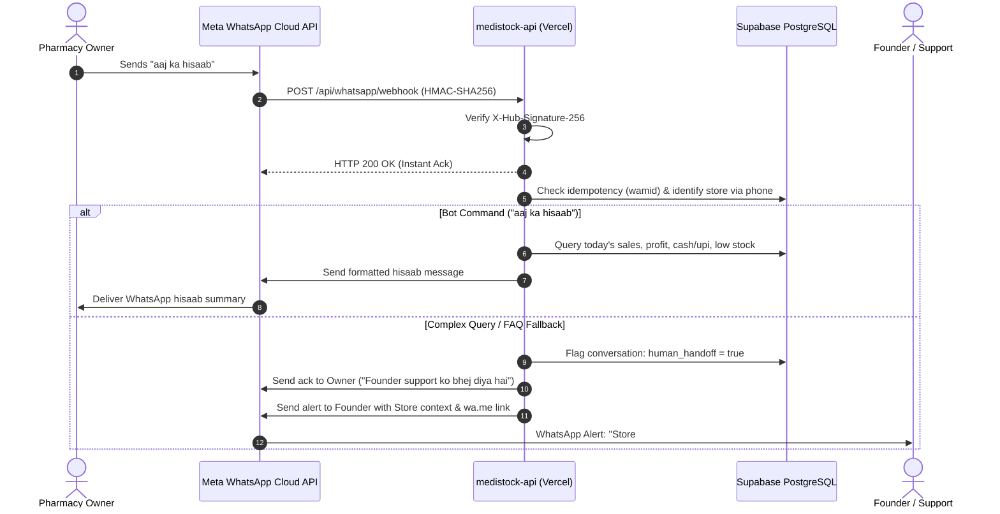
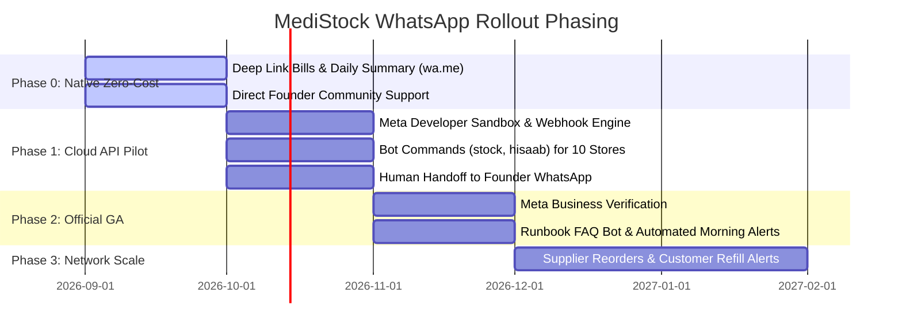

# MediStock WhatsApp Business API Integration Specification

> **Status**: Design / Pre-Implementation Specification  
> **Approach**: Community-First, Zero-Overhead Rollout  
> **Target Execution**: Triggered on founder request upon milestone validation

---

## 1. Executive Summary & Philosophy

MediStock currently uses zero-cost native deep links (`https://wa.me/91...`) for:
- In-store customer bill dispatch with cryptographically pinned HMAC-SHA256 tokens (`/api/public/invoice/:id/pdf?t=...`).
- Pharmacy owner daily hisaab (`/api/whatsapp/summary`).
- Customer Khata (credit) payment reminders.

While deep links incur zero infrastructure cost, they require manual user taps. This specification outlines an official **Meta WhatsApp Business Platform (Cloud API)** integration to provide:
1. **Automated Conversational Assistant**: Responds instantly to pharmacy owners asking for current stock, daily sales reports, and customer bills directly from WhatsApp.
2. **24/7 Runbook-Backed Support Bot**: Deflects 80%+ of common operational questions (printer setup, locked accounts, subscription renewal, scanner configuration).
3. **Seamless Human Handoff**: Escalates complex queries directly to the founder's WhatsApp with full store context.

---

## 2. Architecture & Webhook Receiver on `medistock-api`

### 2.1 Webhook Endpoints

The integration introduces two endpoints under `/api/whatsapp`:

```
GET  /api/whatsapp/webhook  --> Meta Webhook Verification (hub.challenge handshake)
POST /api/whatsapp/webhook  --> Inbound Message & Status Event Receiver
```

#### A. Verification Handshake (`GET`)
Meta requires a one-time verification handshake when registering the webhook in the Meta App Dashboard:
```javascript
// Verification flow:
app.get('/api/whatsapp/webhook', (req, res) => {
  const mode = req.query['hub.mode'];
  const token = req.query['hub.verify_token'];
  const challenge = req.query['hub.challenge'];

  if (mode === 'subscribe' && token === process.env.WHATSAPP_VERIFY_TOKEN) {
    return res.status(200).send(challenge);
  }
  return res.status(403).json({ error: 'Verification failed' });
});
```

#### B. Inbound Event Receiver (`POST`)
- **Signature Verification**: Meta signs all webhook payloads using HMAC-SHA256 with the App Secret in header `X-Hub-Signature-256`. Webhook verifies this in constant-time using `crypto.timingSafeEqual`.
- **Fast 200 OK Handshake**: To prevent Meta from timing out and re-delivering (Meta expects HTTP 200 within 5 seconds), the endpoint immediately acknowledges `200 OK` and processes the event asynchronously.
- **Idempotency**: Meta delivers webhooks with at-least-once semantics. Incoming messages have a unique `wamid` (e.g. `wamid.HBgL...`). The system records incoming message IDs in `whatsapp_events` table to guarantee exactly-once processing.



### 2.2 Database Schema Extensions

```sql
-- Track inbound webhook events for deduplication and audit
CREATE TABLE IF NOT EXISTS whatsapp_events (
  event_id VARCHAR(128) PRIMARY KEY, -- Meta wamid or status id
  event_type VARCHAR(64) NOT NULL,   -- 'message', 'status'
  sender_phone VARCHAR(20),
  payload JSONB NOT NULL,
  processed_at TIMESTAMPTZ DEFAULT NOW()
);

-- Manage conversational state and human handoff
CREATE TABLE IF NOT EXISTS whatsapp_conversations (
  phone VARCHAR(20) PRIMARY KEY,
  store_id INT REFERENCES tenants(id) ON DELETE SET NULL,
  user_id INT REFERENCES users(id) ON DELETE SET NULL,
  state VARCHAR(32) DEFAULT 'idle',          -- 'idle', 'in_faq', 'human_handoff'
  fallback_count INT DEFAULT 0,
  last_interaction_at TIMESTAMPTZ DEFAULT NOW(),
  human_handoff_until TIMESTAMPTZ
);

-- Outbox table for reliable asynchronous outbound messaging
CREATE TABLE IF NOT EXISTS whatsapp_outbox (
  id BIGSERIAL PRIMARY KEY,
  store_id INT REFERENCES tenants(id) ON DELETE CASCADE,
  recipient_phone VARCHAR(20) NOT NULL,
  message_type VARCHAR(32) NOT NULL,         -- 'text', 'template', 'interactive'
  payload JSONB NOT NULL,
  status VARCHAR(32) DEFAULT 'pending',      -- 'pending', 'sent', 'delivered', 'failed'
  retry_count INT DEFAULT 0,
  error_message TEXT,
  created_at TIMESTAMPTZ DEFAULT NOW(),
  sent_at TIMESTAMPTZ
);

CREATE INDEX IF NOT EXISTS idx_wa_outbox_pending ON whatsapp_outbox(status) WHERE status = 'pending';
CREATE INDEX IF NOT EXISTS idx_wa_conv_store ON whatsapp_conversations(store_id);
```

### 2.3 Reusing Existing WhatsApp Outbox & Formatting Patterns

The new integration builds directly upon tested patterns already present in MediStock:
1. **Phone Number Sanitization**: Reuses the regex normalizer in `server/index.js:2719` (`phone.replace(/\D/g, '').slice(-10)` -> prepended with `91`).
2. **URL Length Guard**: Adheres to the `<1800` character limit established in `client/src/utils/whatsapp.js` to ensure links and payload parameters never truncate.
3. **Daily Summary Aggregator**: Reuses the exact aggregation query from `GET /api/whatsapp/summary` (`server/index.js:1551`) for `aaj ka hisaab`.
4. **Pinned Invoice HMAC Tokens**: Invoices shared via WhatsApp continue using `INVOICE_SHARE_SECRET` HMAC tokens (`/api/public/invoice/:id/pdf?t=...`), ensuring safe public view without login.

---

## 3. Knowledge Base & FAQ Bot (Runbook-Grounded)

The bot operates with a dual-language (Hinglish + English) intent matcher tailored to Indian retail pharmacy owners. It directly translates operational recovery steps from [`docs/runbook.md`](runbook.md):

| Intent / Issue | Common User Phrases | Knowledge Base Resolution (from runbook.md) |
|---|---|---|
| **Account Locked (Brute Force)** | *"Account lock ho gaya"*, *"login nahi ho raha"*, *"invalid password bar bar"* | Explains that 8 wrong attempts trigger a 15-minute security lock (Incident A). Informs them it unlocks automatically in 15 mins, or offers a verified self-service unlock link. |
| **Subscription Activation** | *"Payment ho gaya par Starter nahi dikha"*, *"money cut but no upgrade"* | Explains webhook processing flow (Incident D). Asks for Razorpay Payment ID (`pay_...`), checks status against `tenant_payments`, or reconciles instantly. |
| **Printer Setup** | *"Thermal printer kaise jodein"*, *"slip print nahi ho rahi"*, *"receipt cut nahi ho rahi"* | Provides click-level steps for 58mm / 80mm ESC/POS USB and Bluetooth thermal printers on Chrome Android / Windows. |
| **Barcode Scanner Setup** | *"Scanner kaam nahi kar raha"*, *"barcode scan nahi ho raha"* | Explains plug-and-play USB HID keyboard emulation mode and USB OTG adapter activation on Android phones. |
| **Offline Billing** | *"Net disconnect ho gaya to bill banega?"*, *"wifi off hone par kya karein"* | Clarifies that MediStock Service Worker v3 caches the POS shell; bills can be rung up offline and sync automatically once online. |
| **Khata / Udhaari** | *"Customer ki baiki kaise dekhein"*, *"udhaari ka payment link"* | Explains how to open Khata screen -> tap WhatsApp icon next to customer to send automatic UPI payment link. |
| **Inventory CSV Import** | *"Stock ek sath excel se kaise dalein"*, *"bulk upload format"* | Explains Settings -> Inventory Import -> download sample CSV template -> note the 3 imports / 10 min rate limit. |

---

## 4. Inbound Bot Commands

When a pharmacy owner messages the WhatsApp Business number, the bot detects their registered phone number from `tenants.owner_phone` or `users.phone` and enables instant store commands:

### Command 1: `stock <medicine_name>`
* **Syntax**: `stock <name>` or `dawa <name>` (e.g., `stock paracetamol`, `stock dolo 650`, `stock azithral`)
* **Behavior**:
  - Fuzzy-matches against `medicines` where `store_id = :store_id AND is_active = 1`.
  - Returns top 3 matching medicines with current batch, total stock, rack location, MRP, and expiry date.
* **Sample Response**:
  ```text
  📦 MediStock Inventory
  Found 1 match for "dolo 650":

  • DOLO 650 MG TABLET
    Batch: DL-8892 | Rack: A-3
    Stock: 42 Strips (420 tabs)
    MRP: ₹34.50 | Exp: 04/2027
  ```

### Command 2: `aaj ka hisaab` / `today` / `hisaab`
* **Syntax**: `aaj ka hisaab`, `hisaab`, `today`, `summary`
* **Behavior**:
  - Runs the proven summary routine from `server/index.js:1551`.
* **Sample Response**:
  ```text
  📊 Aaj Ka Hisaab — City Medico
  📅 Sunday, 13 Sep 2026

  💰 Total Sale: ₹14,820.00
  💵 Cash: ₹9,200.00
  📱 UPI / Online: ₹4,120.00
  📝 Khata (Udhaari): ₹1,500.00

  📈 Estimated Net Profit: ₹3,240.00
  🧾 Bills Generated: 38

  ⚠️ Low Stock Items: 4 medicines
  ⏳ Expiring in 30 Days: 2 batches
  ```

### Command 3: `bill <invoice_no_or_phone>`
* **Syntax**: `bill 42`, `bill INV-2026-0042`, `bill 9876543210`
* **Behavior**:
  - Finds the matching invoice. Generates a fresh cryptographically pinned share URL.
* **Sample Response**:
  ```text
  🧾 Invoice #INV-2026-0042
  Customer: Rajesh Kumar (9876543210)
  Total: ₹450.00 (3 items) | Paid via UPI

  View & Download Bill:
  👉 https://medistock-pos.vercel.app/public/invoice/42?t=e3b0c44...
  ```

---

## 5. Human Handoff Protocol

When a query is ambiguous, emotionally urgent, or requests human intervention, automated responses are paused and routed to the founder.

### 5.1 Escalation Triggers
1. **Explicit Keywords**: `"founder"`, `"human"`, `"agent"`, `"baat karni hai"`, `"complaint"`, `"urgent help"`.
2. **Consecutive Bot Fallbacks**: If the bot responds with fallback ("Mujhe ye samajh nahi aaya...") 2 times in a single session.

### 5.2 Escalation Sequence
1. **Store Notification**: The bot sends a warm acknowledgement to the pharmacy owner:
   > *"Aapki query founder support team ko bhej di gayi hai. Hum WhatsApp par 15–30 minutes ke andar aapse connect karenge. Aap apna sawal yahan detail me bhej sakte hain."*
2. **State Lock**: `whatsapp_conversations.state` is set to `'human_handoff'` with `human_handoff_until = NOW() + INTERVAL '2 hours'`. The automated bot is muted for this sender so it does not interrupt a human conversation.
3. **Founder WhatsApp Alert**: The system dispatches an alert template to the founder's verified mobile number:
   ```text
   🚨 MediStock Support Alert
   Store: City Medico (ID: #11)
   Owner: Naved (+91 98765 43210)
   Issue: "Printer connect nahi ho raha bluetooth se"

   👉 Click to chat with owner:
   https://wa.me/919876543210?text=Hi%20Naved,%20MediStock%20support%20se%20baat%20kar%20raha%20hu
   ```

---

## 6. Meta Pricing Analysis & Cost Model (India / APAC)

Meta categorizes WhatsApp Cloud API conversations into 4 billing buckets (24-hour window per conversation):

| Conversation Category | Description | India Rate (Per 24h Window) | MediStock Usage |
|---|---|:---:|---|
| **Service (User-Initiated)** | Inbound bot queries (`stock`, `aaj ka hisaab`, FAQ) | **FREE for first 1,000 / mo**; then ~₹0.35 | Primary mode for bot interactions. |
| **Utility (Business-Initiated)** | Bill dispatch, expiry alerts, low-stock alerts | ~₹0.11 - ₹0.15 | Scheduled summaries and customer bills. |
| **Authentication (OTPs)** | Login verification, password reset | ~₹0.11 - ₹0.15 | Optional future 2FA. |
| **Marketing** | Promotional campaigns, offers | ~₹0.75 - ₹0.85 | **Not used** (preserves brand trust). |

### 6.1 Projected Operating Costs by Milestone

| Milestone | Active Stores | Estimated Monthly Conversations | Free Tier Offsets | Net Monthly Cost to MediStock | Revenue Offset |
|---|:---:|:---:|:---:|:---:|:---:|
| **Alpha (Current)** | 1–5 | ~150 service conversations | 1,000 free | **₹0.00 / month** | Self-funded |
| **Milestone 1** | 25 | ~750 service + 200 utility | 1,000 free | **< ₹30 / month** | ₹7,475 MRR (Starter/Pro) |
| **Milestone 2** | 100 | ~3,000 service + 1,000 utility | 1,000 free | **~₹850 / month** | ₹35,000+ MRR |
| **Milestone 3** | 500 | ~15,000 service + 5,000 utility | 1,000 free | **~₹5,500 / month** | ₹1,75,000+ MRR |

> [!TIP]
> Because Meta provides **1,000 free service conversations every month** per WhatsApp Business Account (WABA), the bot is **100% free** during the initial community rollout (up to ~35 active stores).

---

## 7. Meta Business Verification Requirements Checklist

Direct WhatsApp Cloud API access requires zero ongoing aggregator fees (avoiding Twilio/Gupshup markups), but requires Meta Business Verification:

- [ ] **1. Dedicated Phone Number**: A fresh SIM or virtual number not currently active on WhatsApp personal or WhatsApp Business app (or account explicitly deleted from mobile app).
- [ ] **2. Meta Business Manager Account**: Created at `business.facebook.com` with Two-Factor Authentication (2FA) enforced on all admins.
- [ ] **3. Legal Entity Proof (Any One)**:
  - GSTIN Registration Certificate.
  - MSME / Udyam Registration Certificate.
  - Drug License (Form 20/21) in the name of the business entity.
  - Shop & Establishment Certificate.
- [ ] **4. Address & Phone Proof**: Utility bill (electricity/telephone) or bank account statement with exact legal name and matching address.
- [ ] **5. Official Website (`https://medistock.in`)**:
  - Must display legal business name in footer.
  - Must display Contact Us (matching registered email/phone).
  - Must have active Privacy Policy and Terms of Service links.
- [ ] **6. Display Name Compliance**: Display name (e.g. `MediStock Assistant` or `MediStock Support`) must adhere strictly to Meta's Display Name Guidelines.

---

## 8. Phased Community-First Rollout Plan



### Phase 0: Current Baseline (1–5 Stores) — Zero Marginal Cost
- Maintain native deep links (`wa.me`) on POS and Dashboard.
- Direct community interaction: founder personally communicates with alpha store owners in a private WhatsApp group.
- Collect real questions and Hinglish phrasing patterns to feed into the bot training corpus.

### Phase 1: Closed Pilot (10–25 Stores) — Free Tier Cloud API
- Register App on Meta Developer Portal using the free tier.
- Deploy `/api/whatsapp/webhook` receiver on `medistock-api`.
- Enable 3 core commands: `stock`, `aaj ka hisaab`, `bill`.
- Human handoff routes unhandled queries to the founder's phone.
- Monthly cost: **₹0**.

### Phase 2: Verified Production (25–100 Stores) — General Availability
- Complete Meta Business Verification to lift messaging tier limits.
- Deploy Runbook-backed FAQ engine (printer, scanner, billing, locks).
- Scheduled automated daily morning/evening business summaries (Elite tier).
- Net monthly cost: **< ₹850/mo** (comfortably funded by Pro/Elite subscriptions).

### Phase 3: Commercial Expansion (100+ Stores)
- Automated supplier purchase order routing via WhatsApp.
- Customer chronic medication refill reminders (opt-in).
- Dedicated customer support dashboard in Founder Superadmin console.
